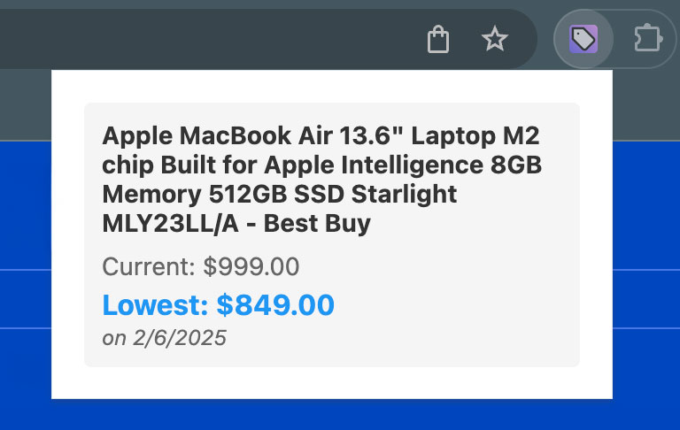

# Price History Tracker

A lightweight Chrome extension that helps you track product prices across any shopping website. See the lowest price you've encountered for any product with a single click.

## Features
- Track prices automatically on any shopping site
- See current and lowest recorded prices
- All data stored locally in your browser
- No sign-up required
- Zero data collection

## Installation
Install from the Chrome Web Store (submission is pending review)

## How to Use
1. Install and pin the extension
2. Visit any product page
3. Click the extension icon to view price history
4. Return anytime to compare current prices with your recorded lowest

## Privacy
All price data is stored locally in your browser. No data is collected or transmitted.